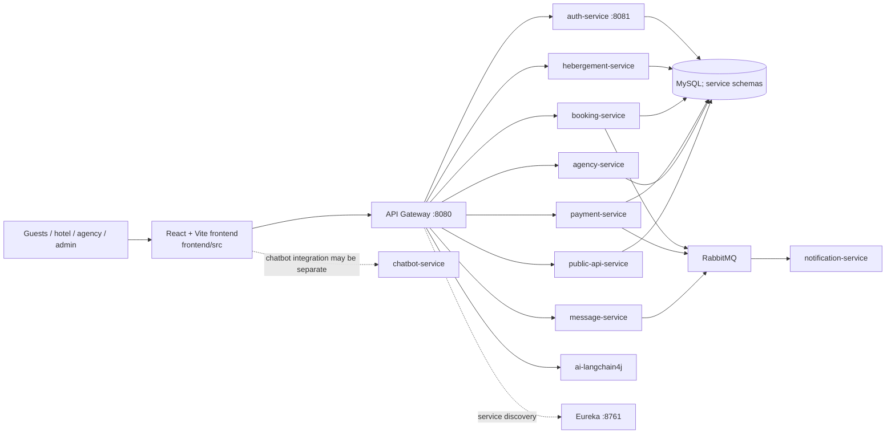

# Claude handoff — LuxTech

Use this file as a compact project map before taking the next task. It is based on the repository and its docs, not a transcript of earlier chat sessions. No usable Git history/status was available here, so uncommitted work and earlier conversational decisions may be missing.

## Project in one sentence

LuxTech is a hotel/property management and reservation platform built with React/Vite and Java 17/Spring Boot microservices. The checked-in architecture is the source of truth; the V2.5 requirements/planning doc discusses preserving this Java/React baseline.

## System graph

## Code map

| Area | Location | Responsibility / clues |
|---|---|---|
| Frontend | `frontend/src` | React app; public pages, auth, admin, agency and hotel dashboards; API clients in `src/api`; i18n in `src/i18n/locales` (fr/en/ar). |
| Edge/discovery | `api-gateway`, `eureka-server` | Gateway routing/JWT edge and service registry. |
| Identity | `auth-service` | Accounts, login and JWT-related APIs. |
| Hotel PMS | `hebergement-service` | Lodging/property operations, rooms, services, rates, reservations and hotel portal APIs. |
| Booking/payments | `booking-service`, `payment-service` | Reservation lifecycle and payment integration/events. |
| Partners/public | `agency-service`, `public-api-service` | Agency workflows and public-facing hotel/search endpoints. |
| Messaging | `message-service`, `notification-service` | Messaging/WebSocket and RabbitMQ-driven notification delivery. |
| AI | `ai-langchain4j`, `chatbot-service` | Separate AI/RAG prototype and chatbot service; verify which is wired into the requested feature before changing either. |
| Docs/runtime | `docs`, root `pom.xml`, `docker-compose.yml` | V2.5 plan/audit, Maven multi-module build, local infrastructure and service wiring. `uploads/` holds user media/files; avoid indexing its contents unless needed. |

## Existing planning/audit work

`docs/LUXTECH_V2.5_GANTT_AND_AI_POC.md` contains the detailed V2.5 scope, an estimated 24-week plan, current-state findings, security/messaging recommendations, and a narrow read-only hotel-policy RAG proof of concept. Treat timeline dates as planning assumptions, not commitments. Important findings called out there: service-level authorization/tenant isolation needs review; some security chains are permissive; notification RabbitMQ retry/ack behavior and exchange/routing contracts need attention; Compose contains development credentials/exposed service ports; email/SMS/WhatsApp provider setup is incomplete. Read that doc only when the task touches planning, security, messaging, notifications, or AI.

## Known repo mismatches to verify before changing deployment

- Maven modules include `hebergement-service`, while Compose/README refer to `hotel-service`; check actual Compose build paths before using it as the deployment truth.
- The repo also has `chatbot-service` and a separate `ai-langchain4j` Maven module. Their relationship/wiring is not obvious from the top-level map.
- Compose, docs and checked-in application configuration may differ. Inspect the target service's `src/main/resources/application.yml` and gateway routes for the concrete task.

## Build/run pointers

- Backend: root `pom.xml` is the Maven parent; Java 17, Spring Boot 3.2.3, Spring Cloud 2023.0.1. Run Maven from this directory and select relevant modules.
- Frontend: `cd frontend`; scripts are `npm run dev`, `npm run build`, `npm run lint`.
- Local infrastructure instructions are in `README.md` and Compose; verify service names/paths first because of the mismatch above.
- Never copy credentials from Compose/config into generated answers. Use env/secrets for any new configuration.

## Task handoff prompt

“Read `CLAUDE_HANDOFF.md` first. Then inspect only the files relevant to my task: **[paste task]**. Preserve the existing Java/Spring + React architecture unless I explicitly request a migration. Before editing, trace the relevant frontend route/API client → gateway → service/controller → persistence/events. Report the files you intend to change, implement the task, and summarize validation and any unresolved assumptions.”
