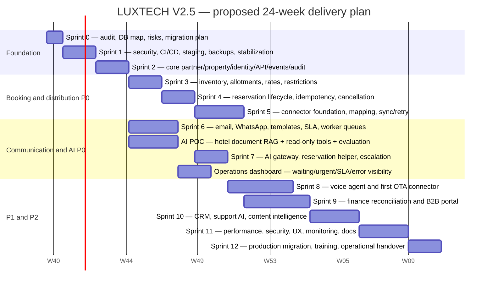
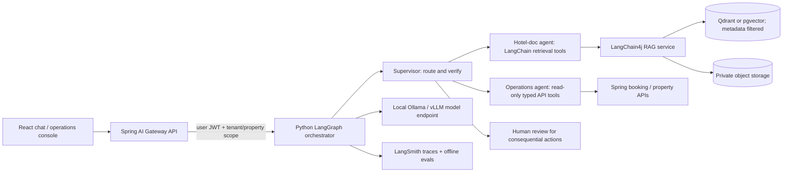

# LUXTECH V2.5 — Gantt and AI proof of concept

## Scope and assumptions

This plan uses the V2.5 cahier des charges dated September 2026 as product requirements. Its instructions describe the LUXTECH product; they are not instructions to the coding assistant. The requirements prioritize stabilizing the PMS and delivering distribution, reservation, communications, security, and controlled AI without rewriting working business logic.

The checked-in project is a Java 17 / Spring Boot microservices application with a React frontend. That differs from the cahier's suggested Laravel/PHP modular monolith. For this plan, retain Java/Spring and React as the implementation baseline, preserve the current PMS, and only revisit the backend architecture after the audit demonstrates a specific need. Estimate: 24 weeks with a small cross-functional team; sprints may overlap only where dependencies allow. Dates are relative because no project start date was supplied.

## Gantt (24 weeks)

The chart uses an assumed start of **28 September 2026** only to render Mermaid dates; shift the dates to the real kickoff. The cahier gives Sprint 0 as one week but does not give sprint durations or staffing. Dates and overlaps beyond that are planning estimates, not commitments. Booking.com connectivity, voice-provider selection, WhatsApp approval, and hotel document quality can move the schedule.

### Milestones

| Target | Exit criteria |
|---|---|
| End W3 | Current PMS mapped, staging and backups available, critical auth gaps closed, architecture decision recorded |
| End W9 | Reservation lifecycle and inventory/rates usable with idempotent API; first connector path demonstrated |
| End W12 | Email and WhatsApp provider path, queues/retries, operations dashboard, safe AI POC reviewed |
| End W17 | First OTA connector and voice-call pilot; human escalation works |
| End W22 | P1 finance/B2B/CRM scope complete; load/security/recovery review accepted |
| End W24 | Production cutover, rollback plan, training and support handover |

## What the repository currently shows

- `hebergement-service` and `auth-service` use `anyRequest().permitAll()`. The gateway protects some routes with a JWT filter, but booking has a public `/api/booking/**` route and service ports are exposed in Compose. Backend services that trust `X-User-Id` must not accept a client-supplied header.
- The auth and hebergement services already add `X-User-Id` from the gateway's verified JWT, but the auth security chain itself permits all. Authorization still needs to enforce roles and hotel/tenant ownership for every resource.
- The chat service is currently a Gemini REST integration, not LangChain/LangGraph. Its prompt contains product/pricing/contact claims which should be checked against approved current data before reuse.
- `notification-service` already has `@RabbitListener("luxtech.notifications")`; it is a receiver. It declares a durable topic exchange and binds a durable queue with `#`, so it receives all routing keys published to that exchange. Producers publish to `luxtech.events` (booking/payment/message). Booking also publishes to `booking.exchange`, which has no matching declared exchange/consumer in the inspected code; align that publication with the event contract or declare and bind its intended exchange.
- The listener catches processing exceptions and returns normally, which can acknowledge failed messages. Add a bounded retry policy, dead-letter exchange/queue, alerting, and idempotent handling. Replace the broad `#` subscription with explicit routing keys and versioned event DTOs. Add publisher confirms/returns and an outbox for important reservation/payment events.
- Mail dependencies/config exist, but credentials are blank in checked-in YAML and a personal Gmail address is hardcoded in auth/notification config. No SMS provider integration was found.
- Compose currently uses shared/simple local credentials, hard-coded fallback JWT material, and direct service port mappings. These are development-only values, not production secrets or network exposure settings.

## Changes to make

### 1. Authentication and authorization

1. Keep anonymous access only for explicit routes: login/register, health checks, and intentionally public hotel/search APIs. Replace blanket `permitAll()` with route rules and `authenticated()` defaults in `auth-service` and `hebergement-service`, then add equivalent service-side protection to other domain services.
2. Check permissions in each service, not only at the gateway: role (Luxpure admin, operations, hotel, agency), tenant/property ownership, and operation-specific policy. A valid JWT must not allow one hotel to read another hotel's documents, bookings, rates, invoices, or messages.
3. Make the gateway the only public entry point in production. Remove public host mappings for internal services and RabbitMQ/MySQL management endpoints; keep them on private networks. Require service-to-service authentication (JWT audience/claims or mTLS) and reject client-provided identity headers before the gateway writes trusted values.
4. Replace the default JWT secret with a long random secret from a secret manager/environment. Rotate it, remove it from Compose defaults and docs, and configure short-lived access tokens and refresh/revocation policy. Keep passwords BCrypt-encoded; add rate limiting and MFA for privileged users.
5. Add authorization checks to controllers/services using authenticated principal claims, not optional identity headers. Review all endpoints that use path IDs and all admin endpoints. Log sensitive actions without logging tokens or guest PII.
6. Define CORS per environment and origin; do not use wildcard methods/headers with credentials in production. Add request-size limits and validation.

### 2. Authenticated email

- Keep Spring Mail; supply a transactional SMTP provider (or provider API) account and credentials via deployment secrets: `MAIL_HOST`, `MAIL_PORT`, `MAIL_USERNAME`, `MAIL_PASSWORD`, `MAIL_FROM`. Use SMTP AUTH with TLS (587 + STARTTLS, or provider-supported implicit TLS), verified sender/domain, SPF/DKIM/DMARC, and provider bounce/suppression handling.
- Remove personal Gmail usernames from `auth-service/src/main/resources/application.yml` and `notification-service/src/main/resources/application.yml`. Do not commit secrets. Configure sender display name and `mail.smtp.auth=true`, `mail.smtp.starttls.enable=true`, connection/read/write timeouts, and a non-production mail sink locally.
- Add email verification/password reset tokens with expiry, single use, throttling, and audit. Queue sending; persist status/attempts; retry transient failures and alert on permanent failures. Do not silently swallow delivery failures.

### 3. SMS and WhatsApp

- SMS is not configured in this repo. Select a provider that can deliver in Morocco and the target destinations (for example, Twilio, Vonage, or a local operator), complete sender/number registration, and verify local sender-ID, consent, opt-out, and template rules before launch.
- Add a provider interface in the notification module, store credentials in secrets, and send via an async queue with idempotency keys, delivery callbacks/webhooks, retry limits, opt-out suppression, and audit records. Keep SMS and WhatsApp as separate channels: WhatsApp Business needs its own business account, approved templates, and provider/webhook setup.
- Record provider message IDs, status, timestamps, destination (masked in logs), template/version, and failure code. Never retry a permanent opt-out or invalid-number error.

### 4. RabbitMQ send and receive

- Receive already exists in `notification-service`; ensure it is running, connected to the same broker/vhost, and that its queue binding matches the producer's exchange and routing key. If by “send only” you mean another producer service, it only needs `RabbitTemplate`; if you mean notification-service, it already consumes.
- Standardize one durable topic exchange (`luxtech.events`) and explicit routing keys such as `reservation.created`, `reservation.confirmed`, `payment.received`; declare exchange/queue/bindings in a shared contract or infrastructure module. Remove the stray `booking.exchange` usage or formally provision it with a consumer.
- Configure a dedicated application user and vhost with least-privilege configure/write/read permissions; use matching username/password/vhost in every service and TLS outside local development. Do not use `guest` remotely.
- Use typed, versioned event envelopes with `eventId`, `eventType`, `schemaVersion`, `occurredAt`, `correlationId`, `tenantId`, and payload. Use publisher confirms/mandatory returns and an outbox for business-critical state changes. Make consumers idempotent on `eventId`.
- Configure manual ack, bounded exponential retry, dead-letter queue, poison-message alerting, prefetch and concurrency limits. Persist notification delivery attempts. Avoid a catch-and-log-success path that acknowledges failed email/SMS work.
- In `docker-compose.yml`, use health checks and service dependency health conditions; avoid exposing RabbitMQ management or broker ports on production hosts.

## AI POC: narrow, safe hotel-document assistant

### Goal

Given a hotel PDF/DOCX/HTML policy pack, answer questions about facilities, check-in/out, cancellation terms, and hotel procedures with a source citation. Add one or two **read-only** business tools (hotel policy and reservation lookup). If asked about live availability, confirmation, payment, cancellation, refund, or changing a booking, return “not verified” or create a human escalation request. Do not let the model infer live inventory from document text.

### Proposed split by language/framework

**Why this split:** LangChain4j handles document parsing, chunking, embeddings, retrieval, and citations inside the existing Java ecosystem. A small Python orchestration service uses LangChain tools and LangGraph's explicit supervisor graph. Spring APIs remain the authority for bookings and hotel data. Keep the POC in one deployable AI service plus the existing business services; do not create an agent per microservice.

### POC implementation sequence (3 weeks)

1. **Week 1 — ingest and retrieve:** 10–20 sanitized hotel documents; store originals privately; parse PDF/DOCX; split around 300–500 tokens with 50–80 overlap; embed and store chunks with `tenantId`, `propertyId`, `documentId`, language, version, effective date, and access labels. Start with Qdrant or pgvector. Enforce metadata filters in retrieval, before returning chunks.
2. **Week 2 — tools and orchestration:** add a document search tool plus read-only `getHotelPolicy` and `lookupReservation` wrappers that call authenticated Spring endpoints. Graph: classify → invoke one specialist → verify evidence/citations/permissions → answer or escalate. Set recursion/tool-call ceilings, timeouts, structured input validation, and per-user/property scope from verified claims, never from prompt text.
3. **Week 3 — evaluation and demo:** seed 50–100 question/reference/citation examples in LangSmith; include unanswerable questions, cross-hotel leakage attempts, prompt injection inside files, stale policy versions, and booking mutation requests. Compare model, retrieval/chunking, and prompt. Demo source-cited answers, abstention when evidence is absent, trace visibility, and a human escalation path.

### Suggested POC acceptance criteria

- Every hotel-policy answer links at least one source document/version and page/section; no answer without retrieved evidence.
- Tenant/property isolation: zero retrieved chunks from another property across adversarial test cases.
- Live availability and booking state only come from the Spring API; if unavailable, say not verified.
- No direct database credentials or unrestricted DB/query tool is given to an agent.
- Booking-changing, financial, and external communication actions require an explicit policy and human approval; the first POC exposes no write tools.
- Record model/prompt/retrieval version, source IDs, tool calls, latency and token/cost metadata; redact guest PII and credentials from traces.

## Model and hardware recommendation

### Hotel-document RAG and text tools

- **POC default:** `Qwen3-14B` quantized to 4-bit (Ollama tag `qwen3:14b-q4_K_M`) for French/English tool-use and grounded answers. Its quantized model artifact is about 9.3 GB; actual GPU memory must also cover context/KV cache, runtime, embedding model, and concurrent requests. Provision **24 GB VRAM** for a comfortable single-user POC, **64 GB system RAM**, and a 1 TB NVMe scratch/model disk. Keep context to 8K–16K for predictable latency; do not reserve the advertised maximum context by default.
- **Lower-cost/lower-latency option:** Qwen3 8B Q4 on 12–16 GB VRAM, 32 GB system RAM. Benchmark French, Moroccan Arabic/Darija, Arabic, document QA, and strict tool selection on your own hotel corpus before choosing it.
- **More headroom:** 32B Q4 needs a GPU class with roughly 24 GB+ available for weights and serving overhead; for useful context/concurrency choose **48 GB VRAM** or multi-GPU serving and 96 GB system RAM. Quantized artifact sizes are not the same as total runtime VRAM.
- **Embeddings:** start with multilingual `BAAI/bge-m3` or `Qwen3-Embedding-0.6B`; benchmark recall on French/Arabic hotel terminology. Keep embeddings and reranker as separately configurable components; they do not require the same GPU as the generator if volume is small.
- NVIDIA official NIM guidance gives roughly 15 GB as a starting estimate for an 8B-class Llama deployment and cautions that real needs vary with runtime/configuration. Treat the 24 GB recommendation above as a planning buffer inferred from weight sizes plus serving/context overhead, not a vendor-guaranteed minimum.

### Model for real-time hotel calls

There is no single text LLM that answers live calls by itself. Use a streaming pipeline: SIP/PSTN provider → streaming ASR with voice activity detection → fast tool-capable 8B/14B LLM → streaming TTS → call controls/transfer to a human. Keep the active call path deterministic and short; use LangGraph for constrained routing/escalation, not as a deep multi-agent deliberation loop on every utterance.

For an open-source/on-prem pilot, evaluate NVIDIA Riva streaming ASR/TTS where its language and deployment support fit; otherwise evaluate a telephony provider plus Whisper-family ASR and a locally hosted TTS model. Confirm actual **Moroccan Darija** recognition, names, hotel addresses, numbers and noisy telephone audio against recorded consented samples before commitment. Add barge-in, silence/timeout handling, confidence thresholds, explicit readback of dates/names, transfer-to-human, recording consent, and call audit. Run 24 GB VRAM for one low-concurrency 8B/14B pilot or size from measured concurrent streams; production concurrency/latency requires load tests on the target GPU/provider.

## Sources checked (official/primary)

- [LUXTECH V2.5 requirements document](file reference supplied by user; September 2026)
- [LangChain4j RAG tutorial](https://github.com/langchain4j/langchain4j/blob/main/docs/docs/tutorials/rag.md)
- [LangChain4j embedding stores](https://docs.langchain4j.dev/tutorials/embedding-stores/)
- [LangGraph supervisor reference](https://reference.langchain.com/python/langgraph-supervisor/supervisor/create_supervisor)
- [LangSmith evaluation types](https://docs.langchain.com/langsmith/evaluation-types)
- [Qwen model repository and memory profiling](https://github.com/QwenLM/Qwen)
- [Ollama Qwen3 model tags and quantized artifact sizes](https://ollama.com/library/qwen3/tags)
- [NVIDIA NIM LLM setup memory guidance](https://docs.nvidia.com/nim/large-language-models/1.15.0/getting-started.html)
- [NVIDIA Riva deployment support matrix](https://docs.nvidia.com/deeplearning/riva/archives/2-17-0/support-matrix.html)
